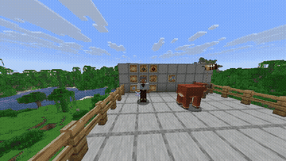
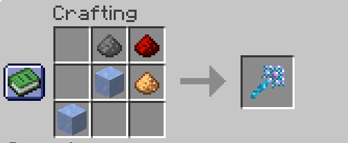

# Wands & Wizards

> A Minecraft mod that introduces magic and wizards into the game. For now, it adds the Ice Wand: a magical weapon that fires an icy projectile capable of freezing any mob it hits, leaving them temporarily unable to move.

This mod is the starting point of a larger project: the plan is to keep expanding it with more elemental wands, enemy wizards with AI capable of using these same wands against the player.

---

## Demo



*Crafting recipe and the Ice Wand in action.*

---

## Features

- Ice Wand: a new craftable item that fires a magical ice projectile.
- Freeze effect: on hitting a mob, the projectile applies a "frozen" status that prevents it from moving for a short time.
- Custom crafting recipe using the crafting table (see image below).
- Codebase designed to scale: lays the groundwork for the wand and magic effect system that will be used for future additions.

---

## Crafting Recipe

<p align="center">
  
</p>

Combine the materials in the crafting table as shown in the image above to obtain your own Ice Wand.

---

## Installation

1. Download the mod from the [Releases](releases)
2. Place the `.jar` file in the `mods` folder of your [NeoForge](https://neoforged.net/) installation.
3. Launch Minecraft with the corresponding NeoForge profile and enjoy.

---

## Building from Source

This project is based on the NeoForge Mod Development Kit (MDK).

```bash
git clone https://github.com/anibalmmdev/WandsWizardsMinecraftMod.git
cd WandsWizardsMinecraftMod
./gradlew build
```

If you're missing libraries in your IDE or run into issues, run `./gradlew --refresh-dependencies` to refresh the local cache, or `./gradlew clean` to reset the environment without affecting your code.

IntelliJ IDEA or Eclipse are the recommended IDEs.

---

## Requirements

- Minecraft (version compatible with NeoForge, check `gradle.properties` for the exact version).
- [NeoForge](https://neoforged.net/) installed.

---

## License

This project is distributed under the terms specified in the repository's license file.

The mapping names used come officially from Mojang and are subject to their own license. See [Mojang.md](https://github.com/NeoForged/NeoForm/blob/main/Mojang.md) for more information.

---

## Additional Resources

- NeoForged community documentation: https://docs.neoforged.net/
- NeoForged Discord: https://discord.neoforged.net/

---

<p align="center">Made by <a href="https://github.com/anibalmmdev">anibalmmdev</a></p>
